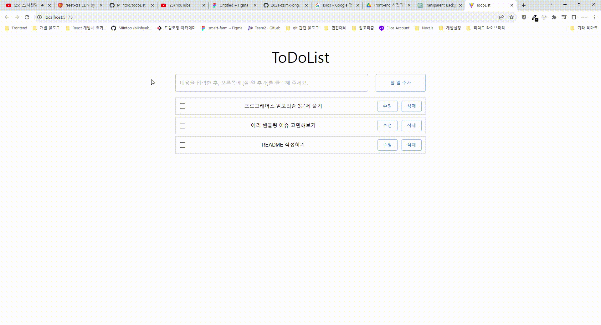
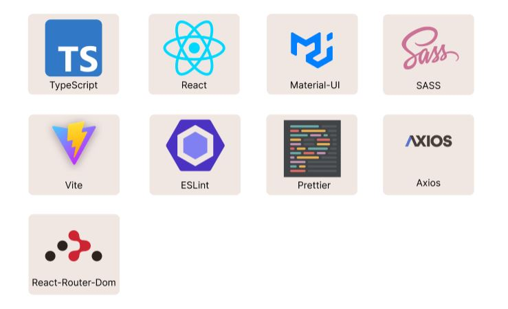
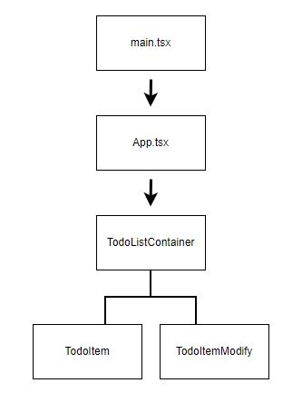

## 프로젝트 소개



오늘 할 일을 기록하는 todoList 프로젝트 입니다.

## 개발 환경



## git commit 컨벤션

```
[Feat] : 새로운 기능 추가
[Fix] : 버그 수정
[Docs] : 문서 추가 및 변경
[Style] : 코드 포맷팅, 로직의 변화는 없이 띄어쓰기나 탭 문자 등의 사소한 변화
[Refactor] : 리팩토링
[Test] : 테스트 코드 수정 및 변경
[Chore] : 그 외 사소한 변경
```

## 프로젝트 구조 소개



- main.tsx
  React 프로젝트 entry 파일 입니다.
- App.tsx
  전체 todoList의 상태를 관리하는 컴포넌트 입니다.
  모든 컴포넌트에 부모 역할을 하고 있고 내부적으로 사이트의 제목과 todoItem 입력 bar와 해당 로직이 구현되어 있습니다.
- TodoListConatainer.tsx
  TodoItem을 그대로 보여주거나 수정 모드로 나눠서 보여주기 위해서 존재하는 컨테이너 컴포넌트 입니다.
  내부에 mode 여부에 따라 나눈 상태값이 있습니다.
- TodoItem.tsx
  TodoItem의 content를 보여주는 컴포넌트 입니다.
  내부에서 api를 요청하는 로직은 따로 없고 내부적으로 checked state를 관리하고 있습니다.
- TodoItemModify.tsx
  수정 모드일때 보여지는 컴포넌트입니다.
  내부적으로 수정이 완료 되었을때 patch 요청을 하는 로직을 호출합니다.

## 구현 방법에 대한 설명

### 에러 헨들링

TodoList 프로젝트를 실제로 운영하고 있는 어플리케이션이라 생각하고 구현하도록 노력했습니다.
안정적인 어플리케이션의 경우 예상할 수 있는 에러와 예상하지 못하는 에러에 대한 에러 헨들링이 굉장히 중요하다고 생각합니다.

- 수정후 저장버튼과 삭제 버튼 클릭시 API 요청을 통해 서버 데이터의 수정을 요청합니다. 그 과정에서 다른 세션에서 이미 해당 TodoItem이 삭제가 되어버린 경우 400 status 에러 코드가 에러 객체로 catch 문에서 받아오는 경우 사용자에게 해당 TodoItem은 이미 삭제가 되었다고 알려주고 todoList의 상태를 업데이트해 삭제가 된 TodoList로 리 렌더링이 되도록 처리 했습니다.
  추가적으로 catch문에 분기점을 둬 에러객체에 code가 client인지 network인가에 따라 나누어 network에러로 오는경우 서버 에러 페이지로 라우팅 설정을 했습니다.

- 삭제의 경우도 수정과 비슷한 경우가 있어 똑같이 처리해줬습니다.

- todoList에 하나도 등록되지 않은 경우 등록된 할 일이 없다고 사용자에게 보여줌으로서 서버로 부터 todoList를 받아오지 못한 경우와 차별을 뒀습니다.

- 할일 등록시 input 값에 50자까지만 제한이 있어 이를 서버에서 글자수를 보고 에러를 헨들링 하는건 네트워크 리소스와 서버 리소스에 좋지 않다는 생각이 들어 클라이언트에서 input 입력시 사용자가 50 글자이상 입력하지 못하도록 maxLength 속성을 추가했습니다.
  api 요청이 실패했을경우 에러 페이지로 라우팅이 되도록 설정했습니다.

- 처음 todoList Item들을 불러올때 서버이슈로 500번대 에러일때 사용자에게 서버 문제라고 알려줄 필요가 있다고 생각했습니다.
  이를 위해서 react-router-dom을 사용해 에러 페이지를 만들고 처음 페이지가 마운트 됐을때 todoList를 조회하는 api 요청시 실패시 서버 문제라고 알려줄 수 있는 페이지로 라우팅이 되도록 설정했습니다.
  그리고 다시 시도 버튼을 이용해서 사용자가 다시 어플리케이션을 실행할 수 있도록 설정했습니다.
  원래라면 상태코드에 따라서 분기로 나누어 axios interceptor에 분기별로 에러 헨들링을 하려고 했지만 따로 상태코드가 나누어져 있는게 아니므로 catch문에 오는 에러는 모두 에러 페이지로 라우팅이 되도록 설정했습니다.

### 할일 추가 로직 작성

할일 추가시 요구 조건에 있는 두가지 예외 요구사항의 우선순위에 대해서 고민했습니다.
사용자의 todoList가 10개가 존재하고 아무 입력도 하지 않았을때는 아무입력도 받지 않았다는 알림보다는
더 이상 리스트를 추가할 수 없다는 알림을 보여줘 사용자가 다시 입력을 하는게 아닌 기존 리스트에 갯수에 문제가 있음을 알게 하는게 좋겠다 생각해서 최대 10개 등록 알림을 우선순위로 두기로 결정했습니다.

### todoList 목록 생성일 기준으로 오름차순 정렬

생성일이 문자열로 되어있고 이를 바로 정렬은 안되기 때문에 Date 객체로 변환해 정렬해야겠다 생각을 했습니다.
sort 함수 내부에 인자인 a, b를 받아 각각을 문자열에서 Date 객체로 변환해 서로 마이너스를 해 구현하려고 했지만 TypeScript에서는 Date 타입은
사칙연산을 하게 되면 에러를 출력하는 이슈가 있었습니다.

이를 해결하기 위해는 Date객체를 숫자 타입으로 변환해주는 내부 메서드중 getDate 메서드와 getTime 메서드를 활용해 정렬하는게 좋겠다 생각을 했습니다.
처음엔 getDate를 이용해 생성일이 빠른순으로 정렬을 하고 만일 getDate 값이 같으면 그 때 getTime 값을 비교해 빠르게 생성한 리스트가 앞으로 가도록 정렬했습니다. getTime은 밀리초단위 까지 측정하기 때문에 할 일 추가를 사용자가 밀리초에 여러번 클릭할 수 없어 두 값이 같은 경우는 고려하지 않았습니다.

### checkbox 클릭시 취소선 표시

MUI를 사용해서 checkbox와 content를 표현했기 때문에 공식문서를 통해서 사용방법을 숙지해 간단히 구현했습니다.
하나의 check 유무 상태값을 컴포넌트 내부에 만들어 checked 됐을때 줄이 보이도록 구현했습니다.

### 수정 버튼 기능

각 todoList 자식 요소들에서 수정 버튼을 클릭했을때 UI요소가 바뀌면서 저장을 하게 되면 서버에도 수정된 내용이 바뀌도록 해야했습니다.
이를 위해서 두가지 UI를 다르게 보여야 하기 때문에 두가지 컴포넌트를 사용해서 조건에 따라서 사용자에게 다르게 보여지도록 구현하는게 좋겠다 생각을 했습니다.

두가지 상태를 처음에 만들었던 TodoItem에서 만들기에는 하나의 컴포넌트에서 두가지 UI를 보여주는 부분이 너무 복잡하고 가독성에도 좋지 않다고 판단을 했습니다. 두가지 상태를 따로 컴포넌트로 만들고 이를 감싸는 부모 컨테이너 컴포넌트를 만들어 부모 컨테이너 컴포넌트에서 수정 유무상태를 관리해 컴포넌트가 렌더링 되도록 설정해서 코드를 작성했습니다.

사용자의 입력에 따라 지속적으로 동기화하는 제어 컴포넌트로 작성하게 되면 렌더링이 지속적으로 발생해 성능에 좋지 않다고 생각을 해서 수정 input 값의 경우 비제어 컴포넌트인 useRef hook을 사용했습니다.

수정 버튼 클릭시 해당 세션이 삭제된 경우 서버에서는 400 client 에러를 응답해주는걸 확인했습니다. 이 경우 try catch문을 이용해서 서버의 api 요청이 실패하는 경우 alert로 사용자에게 할 일이 이미 삭제되었음을 알려주고 해당 id를 이용해서 프론트에서 상태값을 변경해 없어진 리스트를 사용자 UI에 렌더링 하도록 구현했습니다.

### API 로직과 컴포넌트 분리

리액트 컴포넌트내부에 API 로직을 함께 작성하는건 코드의 가독성에도 좋지 않고 유지보수 측면에서도 좋지 않다는 생각이 들었습니다.
따로 api custom hook을 만들어 하나의 파일에서 서버로 통신하는 모든 로직을 정리했습니다.

api 로직을 기존 ts파일이 아닌 custom hook으로 분리한 이유는 api 통신시 에러가 발생할 경우 react-router-dom에 hook중 useNavigate를 활용하기 위해서 따로 ts파일로 로직을 분리하지 않고 컴포넌트로 만들었습니다.

type alias 선언도 하나의 파일에서 타입을 관리하고 유지보수 하기 쉽도록 types.ts 파일을 따로 만들어 분리했습니다.

## 빌드 & 실행 방법

### 설치하기

```
yarn install
```

### 실행하기

```
yarn dev
```
